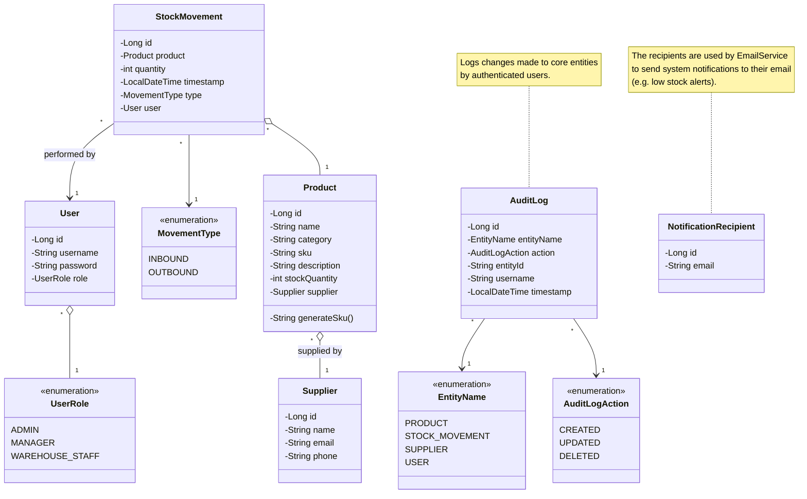

# Class Diagram – Domain Model

This diagram provides an overview of the **core domain model** of the StockTracker system.  
It shows all key entities (business-focused classes) and their relationships.  
The model includes products, stock movements, suppliers, users, roles, audit logs, and notification recipients.

