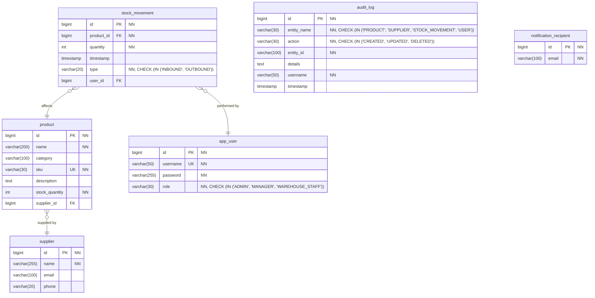

# ER Diagram – Database Model

This diagram provides a visual representation of the **relational database structure** for the StockTracker system,
targeting PostgreSQL.

---

## Notes
- The table `app_user` represents the system users.
- Enums like `MovementType`, `UserRole`, etc., are modeled via `CHECK` constraints in varchar columns.
- The `audit_log` and `notification_recipient` tables are standalone, but used by the system services.
- Foreign key relations are marked with `FK`, primary keys with `PK`, unique key with `UK`, not null columns with "NN",  and constraint `CHECK` is included as documentation hints of expected values.