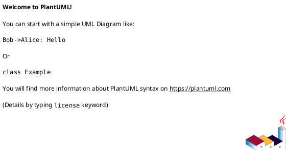

# Use Case Diagram - StockTracker

## Overview
This diagram represents the key interactions between users and the system.

## **Description**
The following PlantUML code serves as the **source for generating a diagram**.  
It can be copied and pasted into the **[PlantUML Online Editor](http://www.plantuml.com/plantuml/uml)**
to visualize or export the diagram as an image.

---

#### **PlantUML Source Code:**
